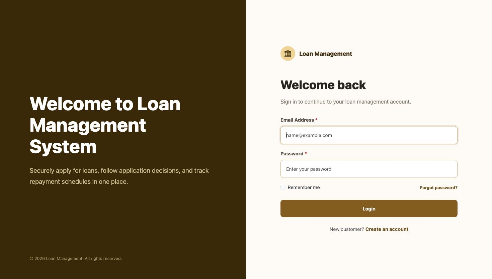
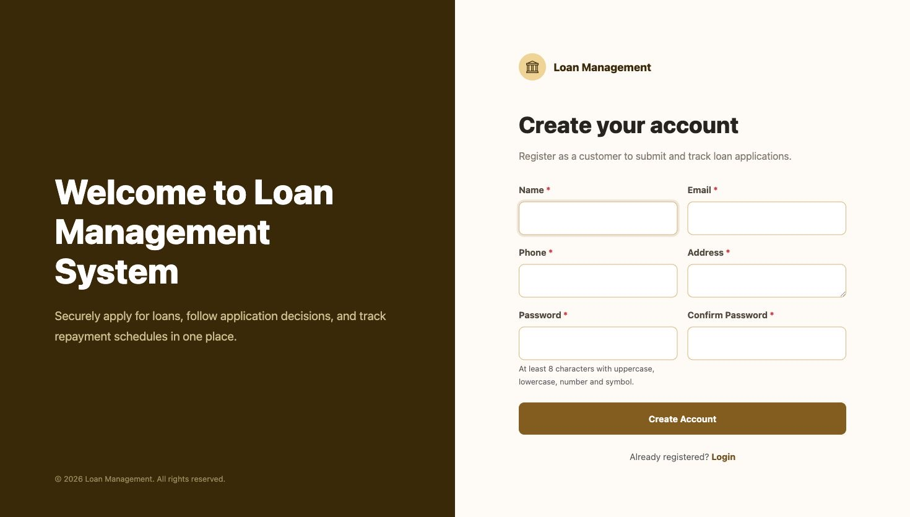
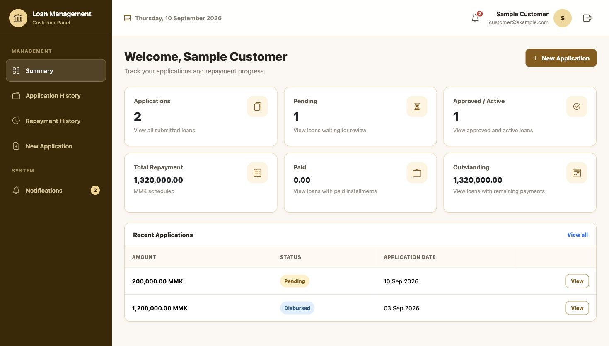
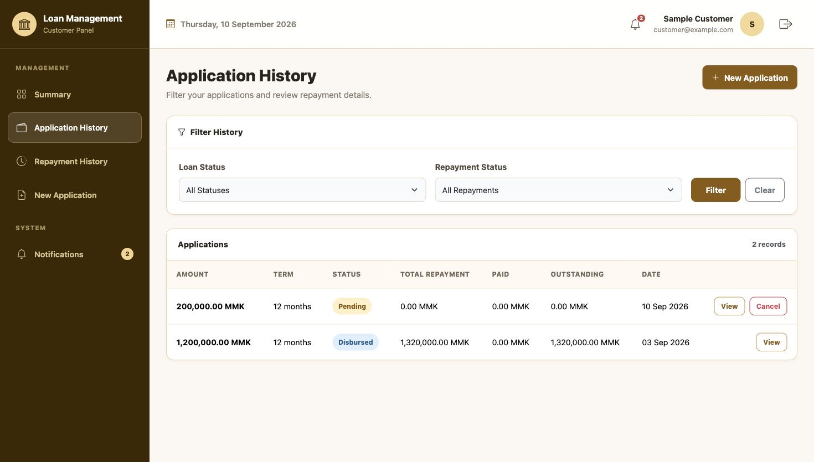
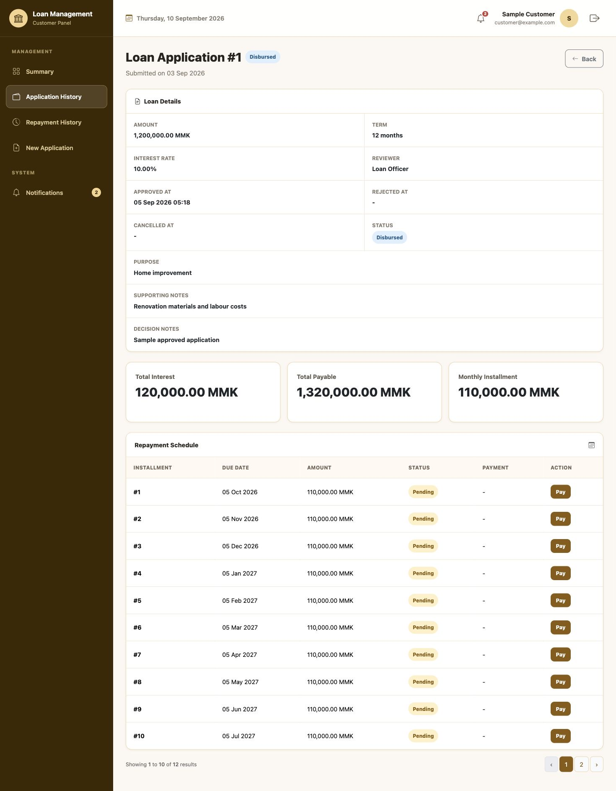
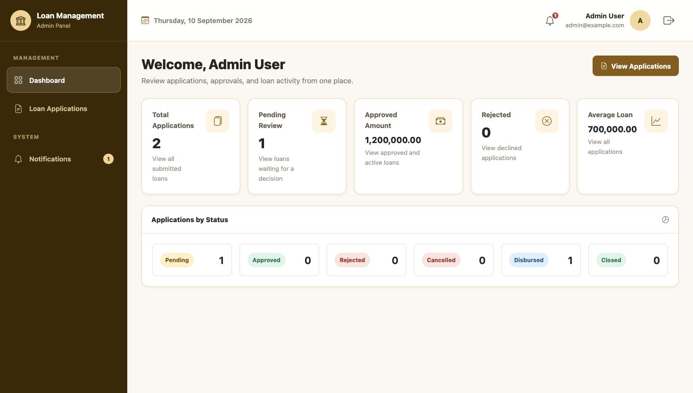
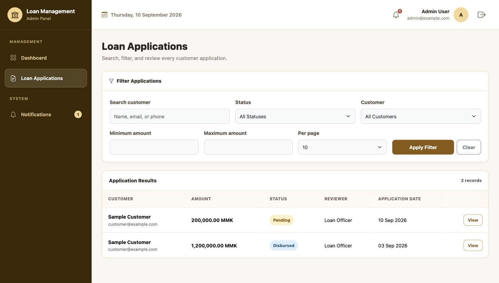
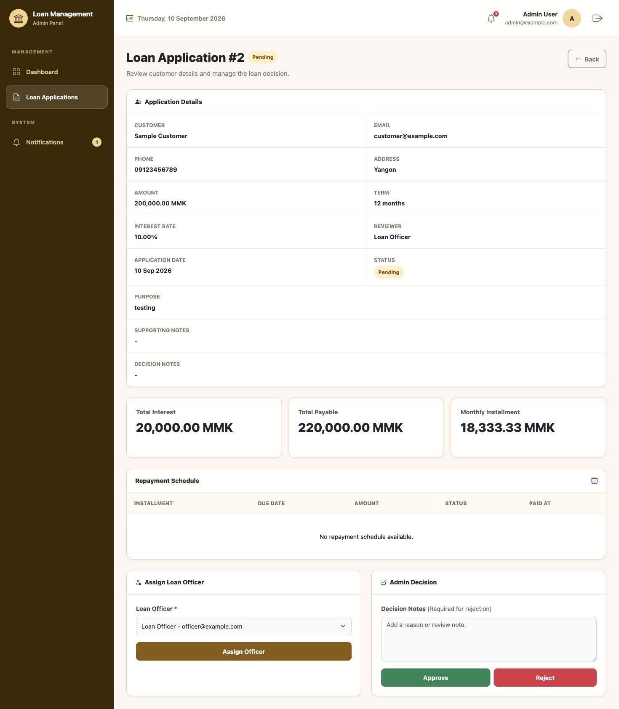
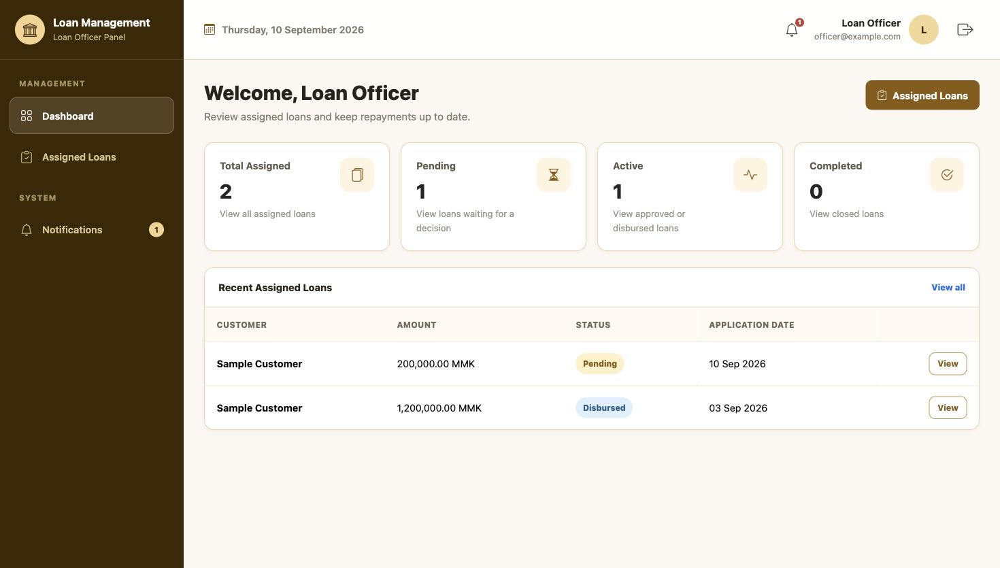
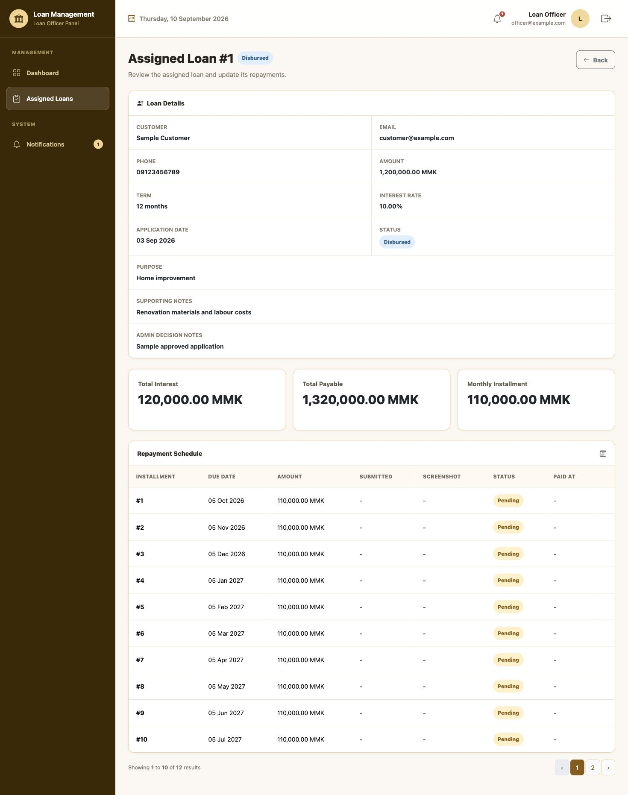

# Loan Management

A Laravel web application for customer loan applications, role-based review, repayment schedules, notifications, and repayment tracking.

## Technology

- Laravel 10.50.3
- PHP 8.1 to 8.3, tested with PHP 8.3
- MySQL
- Blade
- Bootstrap 5
- Bootstrap Icons
- SweetAlert2
- Laravel UI authentication
- Spatie Laravel Permission
- Database Queue
- PHPUnit

## Setup

```bash
composer install
cp .env.example .env
php artisan key:generate
npm install
npm run build
```

Create a MySQL database and update these values in `.env`:

```env
DB_DATABASE=loan_management
DB_USERNAME=root
DB_PASSWORD=
```

Run the database migrations and seeders:

```bash
php artisan migrate --seed
php artisan serve
```

Run the queue worker in another terminal:

```bash
php artisan queue:work
```

Open `http://127.0.0.1:8000`.

For password reset email testing, run Mailpit locally or configure the `MAIL_*` values in `.env` for another mail service.

For Gmail SMTP, enable two-step verification, create a Google App Password, and use placeholders like these:

~~~ini
MAIL_MAILER=smtp
MAIL_HOST=smtp.gmail.com
MAIL_PORT=587
MAIL_USERNAME=your_email@gmail.com
MAIL_PASSWORD=your_google_app_password
MAIL_ENCRYPTION=tls
MAIL_FROM_ADDRESS=your_email@gmail.com
MAIL_FROM_NAME="${APP_NAME}"
~~~

Never add a real email password or App Password to this README, `.env.example`, or Git. After changing mail settings, run:

~~~bash
php artisan config:clear
~~~

## Sample Data

All seeded accounts use `P@ssw0rd` as the development password.

| Role | Email |
| --- | --- |
| Admin | admin@example.com |
| Loan Officer | officer@example.com |
| Customer | customer@example.com |

The seeder also creates one approved sample loan for the customer, assigns it to the loan officer, and creates its complete repayment schedule. Running the seeder again does not duplicate this sample loan or its installments.

These credentials and records are development data only and must not be used in production.

## Roles and Authorization

The application uses Spatie Laravel Permission for role-based access control. Roles and permissions are created by RolePermissionSeeder, assigned to users, and checked with Spatie middleware and can() checks.

| Role | Access |
| --- | --- |
| Admin | View all loans, assign reviewers, approve, reject, disburse, and close loans |
| Loan Officer | View assigned loans and confirm repayments for assigned loans |
| Customer | Create loans, view and cancel owned loans, and submit owned repayments |

Authorization is checked in layers:

1. The auth middleware allows only signed-in users into protected routes.
2. The role middleware separates Admin, Loan Officer, and Customer route groups.
3. The permission middleware protects actions such as approval, rejection, assignment, cancellation, and repayment recording.
4. Form Request authorize() methods use Spatie permissions for request-level checks.
5. Controllers and services check record ownership. A Customer can access only their own loan, and a Loan Officer can access only loans assigned to them.
6. Services check the current loan or repayment status before making a business-state change.

Admin users receive all permissions. Loan Officers and Customers receive only the permissions required for their workflows. Only Admin users have loans.approve and loans.reject.

Policies and custom Gates are not added because Spatie roles and permissions already provide the application-level authorization model. Record-specific ownership checks remain explicit in controllers and services because a general permission alone cannot determine whether a particular loan belongs to the current user.

## Main Workflow

1. A customer registers with name, email, phone, address, and password.
2. The customer submits a loan application.
3. Admin users receive a queued notification and the system prevents a second pending application for the same customer.
4. An Admin searches or filters the review list and assigns a Loan Officer.
5. The assigned Loan Officer and the Customer receive queued in-app notifications.
6. An Admin approves or rejects the pending application with decision notes.
7. Approval creates the complete repayment schedule in the same database transaction.
8. The customer receives an in-app decision notification.
9. The Admin marks an approved loan as disbursed.
10. The assigned Loan Officer confirms customer-submitted repayments as paid.
11. The Admin closes the loan after all installments are paid.
12. The customer tracks status, calculated totals, dates, and repayments from the loan detail page.

## Business Rules

- Loan amount must be between 100,000 and 10,000,000 MMK.
- Loan term must be between 3 and 24 months.
- A customer can have only one pending loan application.
- Only pending applications can be approved, rejected, assigned, or cancelled.
- A Loan Officer must be assigned before an application can be approved.
- Approved applications cannot be rejected and rejected applications cannot be approved.
- Only approved loans can become disbursed.
- Only fully paid disbursed loans can become closed.
- Database transactions and row locks prevent duplicate and conflicting updates.

## Interest Calculation

The application uses flat annual interest:

```text
Interest = Loan Amount x Annual Rate x (Term Months / 12)
Total Payable = Loan Amount + Interest
Monthly Installment = Total Payable / Term Months
```

The loan detail pages show Total Interest, Total Payable, and Monthly Installment. The calculation is implemented in `app/Services/RepaymentScheduleService.php`. The final installment absorbs any decimal rounding difference so all installments equal the total payable amount.

## Admin Loan Filters

The Admin review list supports:

- Customer name, email, or phone search
- Status filter
- Customer filter
- Minimum and maximum amount filters
- 10, 25, or 50 records per page

## Architecture, Boundaries, and Scaling

### Key Design Choices

- The application uses Laravel MVC with Blade and Bootstrap.
- Controllers handle HTTP requests and responses.
- Form Requests handle validation and request authorization.
- Services contain registration, loan, repayment, and interest-calculation business logic.
- Eloquent relationships connect users, customers, applications, reviewers, and repayments.
- Spatie Laravel Permission provides role-based access control.
- Foreign keys and indexes protect relationships and common status queries.
- Database transactions and row locks protect important status changes.
- Server-side pagination limits the number of records loaded at one time.
- A database queue processes in-app notifications outside the main request.

### Tradeoffs

- Flat interest is used because it is simple and matches the assessment scope.
- Blade is used instead of a JavaScript SPA to keep the application simple.
- Repayments accept only full installment payments. Partial payments are not supported.
- Payment screenshots use private local storage and are served only after role and ownership checks.
- Notifications use a simple user-based table instead of Laravel's polymorphic notification structure.
- Loan statuses are stored as strings for simplicity.
- Laravel 10 was selected for this assessment. Its official security support ended on February 4, 2025, so a production continuation should upgrade to a currently supported Laravel version.

### System Boundaries

The system manages customer registration, loan applications, approval decisions, repayment schedules, payment evidence, and in-app notifications.

The current scope does not include:

- Online payment gateway integration
- Partial or early repayments
- Credit scoring
- Penalty and overdue-interest calculations
- Multi-currency support
- Detailed audit history
- Public API or mobile application

### Scaling

If the application grows:

- Redis can replace the database queue for faster job processing.
- Multiple queue workers can process notifications concurrently.
- Dashboard totals can be cached.
- Additional database indexes can be added based on frequently used filters.
- Notifications and status changes can use Laravel events and listeners.
- Server-side pagination can continue to protect large application and repayment lists.

## Future Improvements

### User Management

The `users.manage` permission is reserved for a future Admin user-management page. This page could allow an Admin to:

- View and search users
- Create Admin and Loan Officer accounts
- Update user names and email addresses
- Activate or deactivate accounts
- Assign or change a user's role
- Reset a user's password when necessary

Customers should continue to create their own accounts through the registration page. Customer loan and repayment records should not be deleted when an account is disabled.

### Role and Permission Management

The `roles.manage` permission is reserved for a future role-and-permission page. This page could allow an Admin to:

- View available roles and permissions
- View the permissions assigned to each role
- Assign or remove permissions from a role
- Create another role if the application grows

The current project keeps role and permission definitions in `RolePermissionSeeder` so the authorization setup stays simple, repeatable, and easy to review. There is currently no web UI for managing users, roles, or permissions. Any future management page must remain protected by the Admin role and the related `users.manage` or `roles.manage` permission.

## Testing

Tests use an in-memory SQLite database and do not modify the local MySQL database.

```bash
php artisan test
```

Important tests cover:

- Flat-interest calculation and calculated summary values
- Amount and term validation boundaries
- Duplicate pending-loan prevention
- Customer ownership and cancellation authorization
- Admin filtering
- Reviewer assignment validation
- Role-based page access
- Admin-only approval
- Repayment creation after approval
- Prevention of invalid approval/rejection reversal
- Assignment and decision notifications
- Loan detail summary rendering
- Repayment completion and loan closing

## Screenshots

### Authentication





### Customer







### Admin







### Loan Officer





## UI Walkthrough

### Authentication

- Login provides remember-me and forgot-password links.
- Registration creates both the user and customer profile.
- Forgot-password and reset-password pages use the same responsive authentication layout.
- Logout is available in the top bar.

### Customer

- Dashboard shows application and repayment totals.
- My Applications lists the customer's own loans only.
- New Application validates amount, term, purpose, and optional notes.
- Loan Detail shows status, reviewer, calculated totals, key dates, and repayment schedule.
- A pending application can be cancelled by its owner.

### Admin

- Dashboard shows total, pending, approved amount, rejected count, average amount, and status breakdown.
- Loan Applications supports search, filters, and pagination.
- Loan Detail supports reviewer assignment, approval, rejection, disbursement, and closing according to status rules.

### Loan Officer

- Dashboard and Assigned Loans show only loans assigned to the signed-in officer.
- Loan Detail shows the repayment summary and schedule.
- Installments can be recorded as paid only after the loan is disbursed.

### Notifications

- The bell and sidebar badge show unread notifications.
- Opening a notification marks it as read and opens the related loan.
- All notifications can be marked as read at once.
- New applications and customer cancellations notify Admin users.
- Assignments notify the Loan Officer and Customer.
- Decisions, disbursement, closing, and payment confirmation notify the Customer.
- Payment submission notifies the assigned Loan Officer, or Admin users when no officer is assigned.
- The queue worker must be running to deliver new notifications.

All application screens use the shared responsive Bootstrap layout and support desktop, tablet, and mobile widths.

## Third-Party Packages

- `spatie/laravel-permission` for roles and permissions
- `laravel/ui` for authentication scaffolding
- `bootstrap` and `bootstrap-icons` for responsive UI and icons
- `sweetalert2` for success and error alerts

The repository should be submitted without `.env`, real credentials, API keys, or other secrets.
